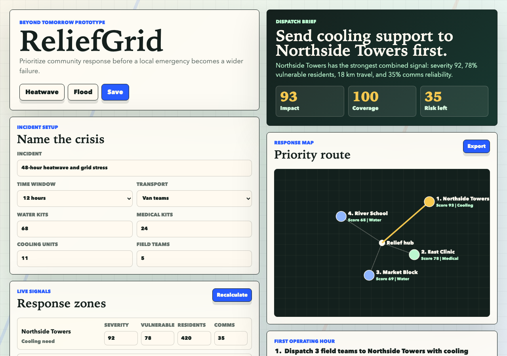

# ReliefGrid

Prioritize community response before a local emergency becomes a wider failure.

ReliefGrid is a Beyond Tomorrow Summit submission for local responders, student organizers, and community teams who need to decide where limited supplies should go first during a fast-moving emergency.

The prototype turns incident signals into a dispatch brief: the top zone, why it is first, which supplies to send, what to do in the first hour, and what fallback to use if the plan slips.



## Why This Exists

Community emergencies rarely fail because nobody cares. They fail because the team has incomplete signals, scarce resources, weak communications, and no shared priority order.

ReliefGrid makes the tradeoff visible. It compares zones by severity, vulnerable population, resource fit, comms reliability, and travel friction, then generates a brief that can be copied, saved locally, or exported as a PNG.

## Core Flow

1. Name the incident, time window, transport mode, and available resources.
2. Review or edit response zones with severity, vulnerable residents, population, and comms signal.
3. Recalculate the priority queue.
4. Inspect the response map and dispatch brief.
5. Copy the brief, save the plan locally, or export a PNG for handoff.

## What Makes It Different

- It focuses on crisis prioritization, not generic dashboards.
- The score is transparent and editable.
- The output is an operational dispatch brief, not just analytics.
- It works locally without an account or cloud dependency.
- It includes a visual response map, scenario loading, local save, copy brief, and PNG export.
- It can be used as a working prototype for heatwave, flood, clinic, or community resource planning.

## Built With

- HTML
- CSS
- JavaScript
- Canvas API
- localStorage
- MediaRecorder for local WebM demo generation

## Run Locally

```bash
python3 -m http.server 8031
```

Then open:

```text
http://127.0.0.1:8031
```

Run QA:

```bash
node final-qa.mjs
```

## Devpost Prep

- Paste-ready fields: `DEVPOST_FIELDS.md`
- Submit runbook: `SUBMIT_RUNBOOK.md`
- Final gate status: `FINAL_GATE_STATUS.md`
- Award readiness audit: `AWARD_READINESS_AUDIT.md`
- Judge brief: `JUDGE_BRIEF.md`
- System QA: `SYSTEM_QA.md`
- Demo script: `demo-script.md`
- Devpost handoff page: `devpost-handoff.html`
- Demo video maker: `demo-video-maker.html`
- Demo video artifact: `reliefgrid-demo-video.webm`
- Pitch deck: `reliefgrid-pitch-deck.pptx`
- Pitch deck builder: `build-pitch-deck.mjs`

## Files

- `index.html` - app shell
- `styles.css` - responsive UI
- `app.js` - scoring, map, dispatch brief, export, save/copy flow
- `qa-check.mjs` - static local QA
- `final-qa.mjs` - final package and localhost QA
- `external-link-check.mjs` - public external link smoke check
- `SYSTEM_QA.md` - browser-tested system QA notes
- `AWARD_READINESS_AUDIT.md` - judging-rubric readiness and remaining risk notes
- `devpost-handoff.html` - local copy buttons and media checklist
- `demo-video-maker.html` - local WebM demo generator
- `build-pitch-deck.mjs` - local PPTX deck generator
- `reliefgrid-main.png` - main dashboard screenshot
- `reliefgrid-brief.png` - dispatch brief/export screenshot
- `reliefgrid-mobile.png` - mobile screenshot
- `reliefgrid-demo-video.webm` - generated local demo video
- `reliefgrid-pitch-deck.pptx` - concise pitch deck for Devpost
